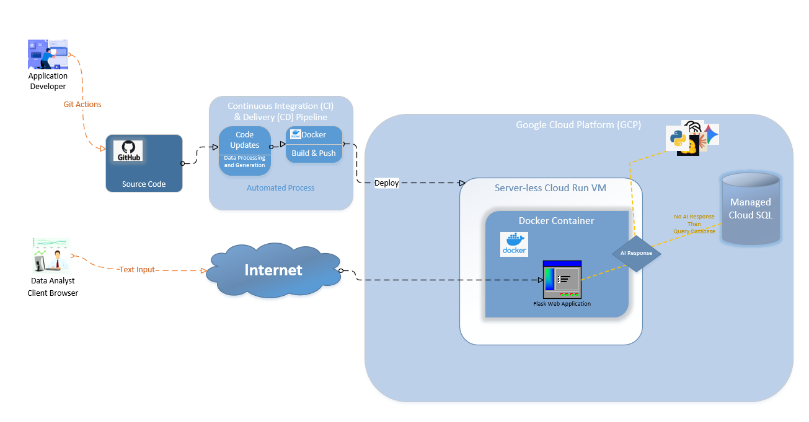

`Architecture & Implementation Plan`
This system is a web-based application designed to streamline data retrieval from Epic Clarity data warehouse with providing data analysts a user-friendly interface to access Epic data handbook links and SQL code snippets. This architecture will be using Python Flask for the frontend, Google serverless Cloud Run for computing, and Google Cloud managed SQL for data storage.
This will also integrate AI search capabilities to allow users to input plain text and receive relevant Epic data handbook links and SQL code snippets.

`Pricing table`
| Service (Cloud)             | Pricing Model                                                          | Monthly Cost (USD)         | Cost per Unit (USD)         |    
|-----------------------------|------------------------------------------------------------------------|----------------------------|-----------------------------|
| Google Cloud Run            | Pay-as-you-go (per request and compute time)                           | Varies                     | 	$0.0000025 per GB-second  |
| Docker                      | Container-based pricing depending on usage and storage                 | Varies                     | Varies                      |
| Google Managed Cloud SQL    |  Pay-as-you-go (2 CPUs 3.8 GiB)                                        | $96.72                     | $96.72 (730 hours per month)|

- [Implementation Plan](/architecture_plan.md)

