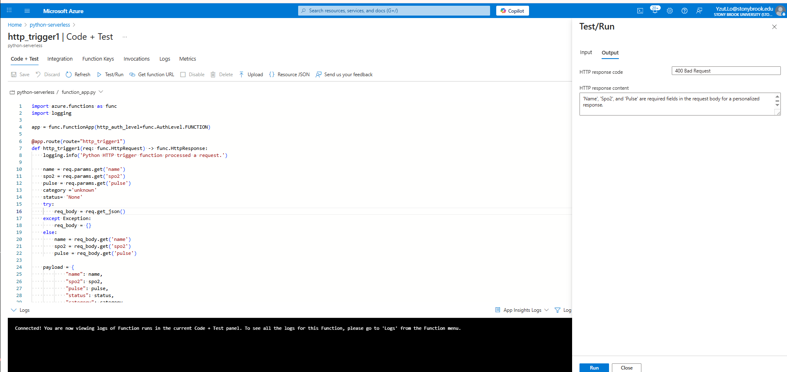
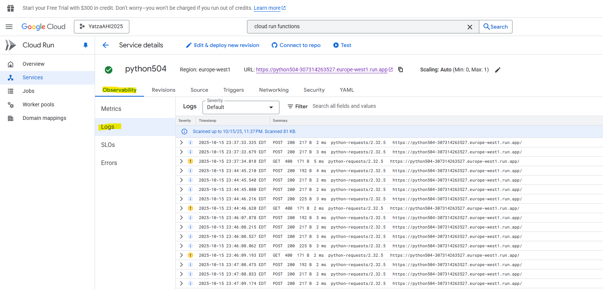
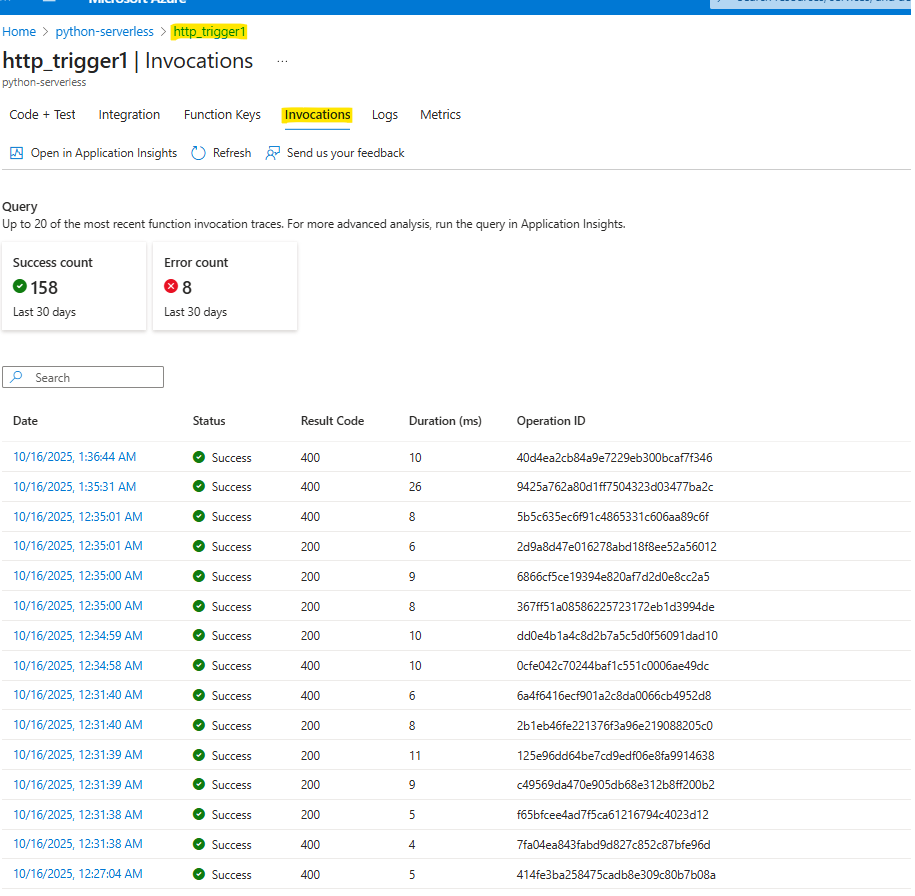

# Cloud Serverless Functions Overview
This project utilizes serverless functions to handle backend logic and API requests. Serverless functions allow you to run code without managing servers, providing scalability and ease of deployment.
## Cloud Endpoints:
- GCP Cloud Functions Endpoint: https://python504-307314263527.europe-west1.run.app
- Azure Functions Endpoint (public): https://python-serverless-gcffbjdngbgcbmg4.westus3-01.azurewebsites.net/api/http_trigger1

> *To call the function with a function key, append the `code` query parameter. Example (local test only —  replace the placeholder locally): https://python-serverless-gcffbjdngbgcbmg4.westus3-01.azurewebsites.net/api/http_trigger1?code=REPLACE_WITH_YOUR_KEY *
    
## Video Recordings:
- Cloud Function Demo Video Links (YouTube) Part 1: https://www.youtube.com/watch?v=ANy6nwHBaV4
- Cloud Function Demo Video Links (YouTube) Part 2: https://www.youtube.com/watch?v=7_mWgpiQGJI
## Learning Goal:
- Create a serverless function that handles HTTP requests and responses.
- Deploy the function to a cloud platform (GCP and Azure).
- Test the function using HTTP requests to ensure it behaves as expected.
- Understand the basics of serverless architecture and its benefits.
- Gain hands-on experience with cloud platforms and their serverless offerings.
- Evaludate the differences between cloud providers in terms of ease of use, features, and performance.
## Benefits of Serverless Functions:
- **Cost Efficiency**: Pay only for the compute time you consume.
- **Scalability**: Automatically scale with the number of requests.
- **Reduced Operational Overhead**: No need to manage infrastructure.
- **Faster Development**: Focus on writing code rather than managing servers.
## GCP vs Azure:
___________________________________________________________________________________________________________________________________________________________
| Feature                 | GCP (Google Cloud Platform)                          | Azure (Microsoft Azure)                                                 |
|-------------------------|------------------------------------------------------|-------------------------------------------------------------------------|
| **Ease of Use**         | User-friendly interface, good documentation          | Integrated with Microsoft tools, slightly more complex to use           |
| **Functionality**       | Supports multiple languages                          | Strong enterprise capabilities                                          |
| **Pricing**             | Pay-as-you-go, free tier available                   | Pay-as-you-go, free tier available                                      |
| **Deployment**          | Simple deployment via CLI or console                 | Integrated with Visual Studio, Azure DevOps                             |
| **Logs and Monitoring** | Logging and monitoring using Observability tools     | Azure Monitor using invocation logs and metrics tools                   |
| **Cold Start**          | Generally fast, but can vary based on region         | Slower response times                                                   |
| **Security**            | Strong security features                             | Strong security features                                                |
| **Regions**             | Wide range of global regions                         | Limited global regions for student accounts                             |
| **Overall**             | Great for startups and small to medium businesses    | Excellent for enterprises and Microsoft-centric environments            |
| **Gotchas**             | Source code will not compile if linting errors exist | Requires resource and services setup in the designated allowable region |
| **Personal Preference** | Preferred for ease of use and quick deployment       | Preferred for enterprise integration and Microsoft ecosystem            |
## Steps to Create a Serverless Function:
1. **Set Up Your Environment**: 
    * GCP - Cloud Run or Cloud Functions
    * Azure - Azure Functions
    Ensure you have a serverless framework or platform set up (GCP and Azure).
2. **Modify http Function**: 
    * GCP - Use the platform's Cloud Run function to edit source code and create a new serverless http_function.
    
    * Azure - Use the platform's function app code+test feature to create a new serverless http_trigger function.
    
3. **Write Your Code**: 
    * GCP - Implement the logic for your function using json and functions_framework.
    * Azure - Implement the logic for your function using logging and azure.functions. 
    This will evaluate HTTP requests and return appropriate responses.
4. **Deploy the Function**: Use the platform's deployment tools to deploy your function to the cloud.
5. **Test the Function**: Use tools like VS Code or browser-based REST clients to send HTTP requests to your function and verify the responses.


# Patient SpO2 and Pulse Rate Evaluation Function:
```
match spo2_val:
        # Classify based on SpO2 and Pulse values
        # Note: Pulse normal range is 60-100 bpm for adults
        # Source: https://www.heart.org/en/health-topics/high-blood-pressure/the-facts-about-high-blood-pressure/understanding-blood-pressure-readings
        # Note: SpO2 normal range is 95-100%
        # Source: https://www.verywellhealth.com/what-is-a-normal-spo2-level-914823
        # Note: SpO2 below 92% is considered low and may require medical attention
        # Source: https://www.mayoclinic.org/tests-procedures/pulse-oximetry/about/pac-20384743
        # Note: SpO2 below 90% is considered very low and requires immediate medical attention
        #   Source: https://www.cdc.gov/coronavirus/2019-ncov/hcp/clinical-guidance/critical-care.html
        # Note: Pulse below 60 bpm (bradycardia) or above 100 bpm (tachycardia) may indicate an abnormal heart rate
        # Source: https://www.heart.org/en/health-topics/arrhythmia/about-arrhythmia
        # Note: Pulse below 50 bpm or above 120 bpm is considered more severe and may require medical attention
        # Source: https://www.heart.org/en/health-topics/arrhythmia/about-arrhythmia
        case _ if spo2_val >= 95 and (pulse_val < 60 or pulse_val > 100):
            status = "Abnormal Heart Rate Warning!"
        case _ if spo2_val >= 95 and (pulse_val < 20 or pulse_val > 120):
            status = "Abnormal Severe Heart Rate Warning!"
        case _ if spo2_val >= 95 and pulse_val >= 60 and pulse_val <= 100:
            status = "normal"
        case _ if spo2_val < 95 and (pulse_val < 60 or pulse_val > 100):
            status = "Abnormal Chronic Condition Warning!"
        case _ if spo2_val < 95 and pulse_val >= 60 and pulse_val <= 100:
            status = "Abnormal Respiratory Warning!"
        case _ if spo2_val < 92 and pulse_val >= 60 and pulse_val <= 100:
            status = "Abnormal Severe Respiratory Warning!"
        case _ if spo2_val < 90 and pulse_val >= 60 and pulse_val <= 100:
            status = "Abnormal Critical Respiratory Warning!"
    category = "Normal" if status == "normal" else "Abnormal"
```
# Expected Output:
- If SpO2 is 95 or below: "abnormal SpO2 Level"
- If Pulse is below 60 or above 100: "Abnormal Pulse Rate"
- If both SpO2 and Pulse are within normal ranges: "Normal"
- If both SpO2 and Pulse are abnormal: "Abnormal SpO2 and Pulse Rate"

# Example Requests and Responses:
## GCP Request Example Code Snippet:
```
import requests
# GCP Testing
gcp_url = "https://python504-307314263527.europe-west1.run.app"
## if post normal
r = requests.post(gcp_url, json={"SpO2": 95, "Pulse": 65})
print("GCP Normal Test: ",r.status_code, r.json())
## if post abnormal respiratory
r = requests.post(gcp_url, json={"SpO2": 82, "Pulse": 70})
print("GCP Abnormal Respiratory Test: ",r.status_code, r.json())
## if post abnormal heart rate
r = requests.post(gcp_url, json={"SpO2": 95, "Pulse": 125})
print("GCP Abnormal Heart Rate Test: ",r.status_code, r.json())
## if post abnormal heart rate and respiratory rate
r = requests.post(gcp_url, json={"SpO2": 80, "Pulse": 125})
print("GCP Abnormal Heart and Respiratory Rate Test: ",r.status_code, r.json())
## if get 
r = requests.get(gcp_url)
print("GCP GET Test: ",r.status_code, r.json())
```
## GCP Response Example:
```
POST normal
200 
{
    'SpO2': 95.0, 
    'Pulse': 62.0, 
    'status': 'normal', 
    'category': 'Normal'
}

POST abnormal respiratory
200 
{
    'SpO2': 90.0, 
    'Pulse': 65.0, 
    'status': 'Abnormal Respiratory Warning!', 
    'category': 'Abnormal'
}

POST abnormal heart rate
200 
{
    'SpO2': 95.0, 
    'Pulse': 125.0, 
    'status': 'Abnormal Heart Rate Warning!', 
    'category': 'Abnormal'
}

GET
400
{
    "error": "Both 'SpO2' and 'Pulse' are required."
}
```
## Google Cloud Platform (GCP) Response:

## Azure Request Example Code Snippet:
```
import requests
import os
from dotenv import load_dotenv
#load_dotenv()
load_dotenv()

azure_url = "https://python-serverless-gcffbjdngbgcbmg4.westus3-01.azurewebsites.net/api/http_trigger1?"+os.getenv("azure_master_key")
## if post missing vitals
r = requests.post(azure_url, json={"name":"Hagrid"})
print("Azure Missing Vitals Test: \n",r.status_code, r.reason, r.text)
## if post normal
r = requests.post(azure_url, json={"name":"Harry Potter","spo2": 95, "pulse": 65})
print("Azure Normal Test: \n",r.status_code, r.reason, r.text)
## if post abnormal respiratory
r = requests.post(azure_url, json={"name":"Hermione Granger","spo2": 15, "pulse": 77})
print("Azure Abnormal Respiratory Test: \n",r.status_code, r.reason, r.text)
## if post abnormal heart rate
r = requests.post(azure_url, json={"name":"Neville Longbottom","spo2": 97, "pulse": 127})
print("Azure Abnormal Heart Rate Test: \n",r.status_code, r.reason, r.text)
## if post abnormal heart and respiratory rate
r = requests.post(azure_url, json={"name":"Ron Weasley","spo2": 56, "pulse": 20})
print("Azure Abnormal Heart and Respiratory Rate Test: \n",r.status_code, r.reason, r.text)
## if get 
r = requests.get(azure_url)
print("Azure GET Test: \n",r.status_code, r.reason, r.text)
```
## Azure Response Example:
```
Azure Missing Vitals Test:
 400 Bad Request 
 Hello Hagrid, 'Spo2' and 'Pulse' are required fields in the request body for a personalized response.
{'name': 'Hagrid', 'spo2': None, 'pulse': None, 'status': "Hello Hagrid, 'Spo2' and 'Pulse' are required fields in the request body for a personalized response.", 'category': 'unknown'}

Azure Normal Test:
 200 OK 
 Hello, Harry Potter. Your oxigenation is 95 with pulse rate of 65. Your report status is Normal. Please review normal status with your healthcare provider.
{'name': 'Harry Potter', 'spo2': 95, 'pulse': 65, 'status': 'normal', 'category': 'Normal'}

Azure Abnormal Respiratory Test:
 200 OK 
 Hello, Hermione Granger. Your oxigenation is 15 with pulse rate of 77. Your report status is Abnormal. Please review Abnormal Respiratory Warning status with your healthcare provider.
{'name': 'Hermione Granger', 'spo2': 15, 'pulse': 77, 'status': 'Abnormal Respiratory Warning', 'category': 'Abnormal'}

Azure Abnormal Heart Rate Test:
 200 OK 
 Hello, Neville Longbottom. Your oxigenation is 97 with pulse rate of 127. Your report status is Abnormal. Please review Abnormal Heart Rate Warning status with your healthcare provider.
{'name': 'Neville Longbottom', 'spo2': 97, 'pulse': 127, 'status': 'Abnormal Heart Rate Warning', 'category': 'Abnormal'}

Azure Abnormal Heart and Respiratory Rate Test:
 200 OK 
 Hello, Ron Weasley. Your oxigenation is 56 with pulse rate of 20. Your report status is Abnormal. Please review Abnormal Chronic Condition Warning status with your healthcare provider.
{'name': 'Ron Weasley', 'spo2': 56, 'pulse': 20, 'status': 'Abnormal Chronic Condition Warning', 'category': 'Abnormal'}

Azure GET Test:
 400 Bad Request 'Name', 'Spo2', and 'Pulse' are required fields in the request body for a personalized response.
```
### Azure Response Example:

## Serverless Function Logs and Monitoring:
- **GCP**: Use Observability tools in the GCP Console to view logs, errors and metrics tomonitor function performance.
  
- **Azure**: Use Azure Monitor in the Azure Portal to view invocation logs and metrics to monitor function performance.
  
# Deliverable Requirements 
Brief intro (name, which two clouds you chose).
Show your repository and where the cloud‑specific code lives.
Show the live endpoint(s) and execute a POST request with two examples (one normal, one abnormal).
Show where to find logs or monitoring in each cloud’s portal.
Mention any gotchas (permissions, runtime version, cold starts).
Upload the recording and place a shareable link in your README.