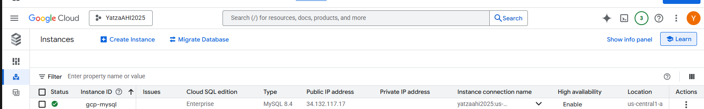
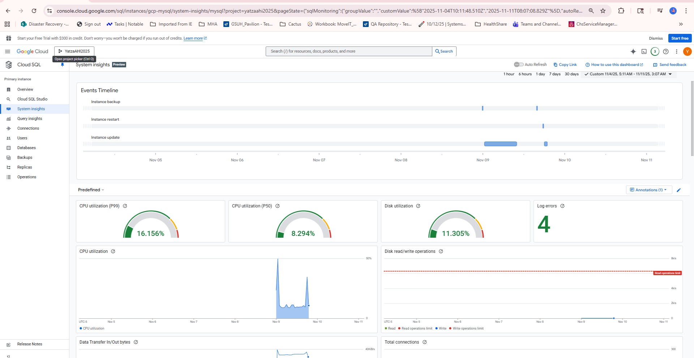
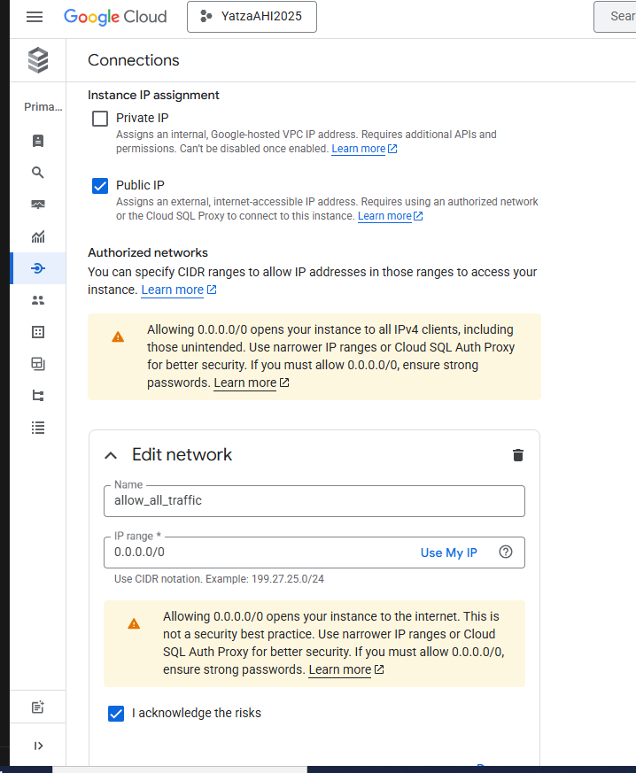
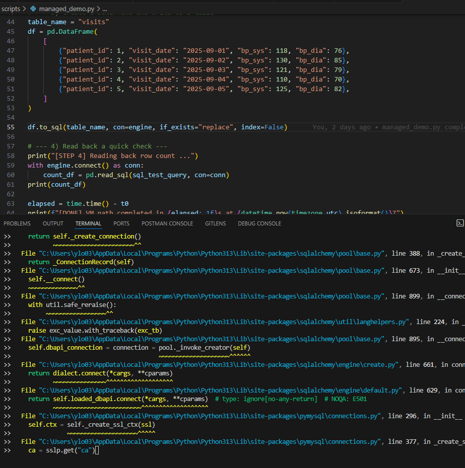
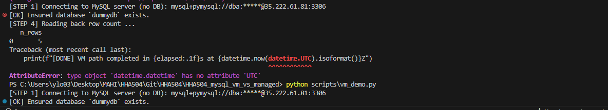
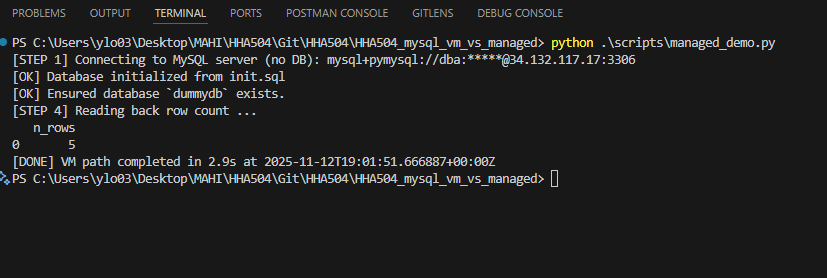
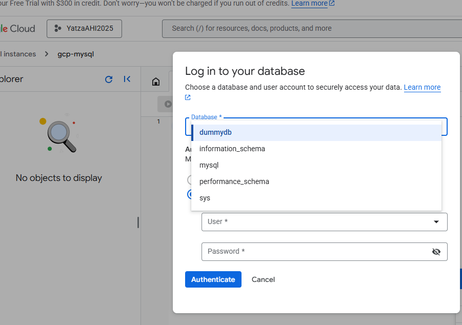
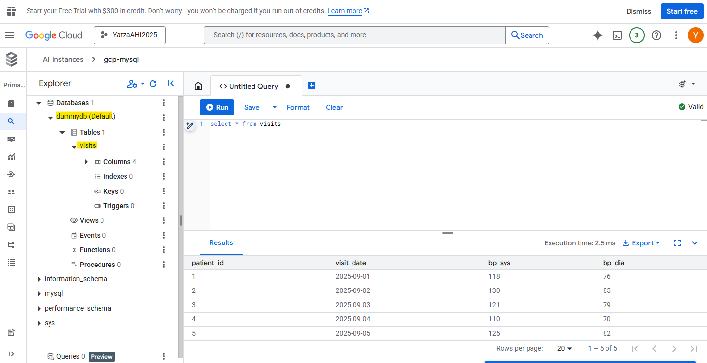
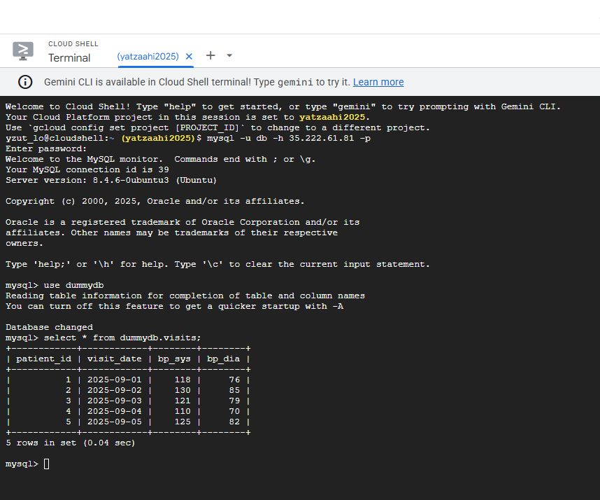

Upon connecting to the managed Cloud SQL environment, I ensured that all necessary network configurations were configured properly. This included creating a new admin account, creating the required databases and tables, and verifying that the environment variables were correctly loaded from the .env file.
1. **Set Up GCP Cloud SQL**
    * Create a new Cloud SQL instance in GCP.
        - use a MYSQL database.
        - Enterprise tier is not required; use the basic tier to minimize costs.
        - Edition preference is Sandbox.
        - Database version is MySQL 8.4.
        - Region is us-central1 (Iowa).
        - Zonal availability is Single-zone.
        - enable firewall rules to allow traffic MySQL port (default 3306).
        - Default TCP database port number is 3306.
    * This will take a 5+ minutes to provision.
     * Start VM Cloud SQL instance terminal to connect
    
    
    * Once the instance is created, set up a root password for the instance.
    * Enable public IP connectivity and add your client machine's IP address to the authorized networks to allow remote connections.
        - Add a network with name "allow-all" IP range set 0.0.0.0/0 with assignment public IP address, the /0 prefix length means that zero bits of the address are fixed.
        - acknowledge the security warning about allowing connections from any IP address.
         
    * Created a new MySQL admin user and database for the project using cloud SQL User accounts.
    )
2. **Install server packages; enable and start service.**
   * Set strong root password (or auth plugin).
   * Edit `/etc/mysql/mysql.conf.d/mysqld.cnf` (bind-address), restart service.
   * Configure firewall/security group rules minimally; note your choices in `setup_notes_vm.md`.
3. **Test Locally VS Code and external Cloud Console (GCP) environment**
    * `mysql -u <user> -p -h <VM_HOSTNAME> -P <VM_PORT> <VM_DATABASE>` from VM opening port 3306
    * Validate connectivity from VS Code terminal using the same command.
    
    * Encountered and resolved connection issues by checking firewall rules and MySQL user permissions to allow allow remote access.
    
    * Address issue with permission problems by updating network settings to allow public IP connections from 0.0.0.0 to 0.0.0.0/0. This allowed all IP addresses to connect to the Cloud SQL instance.
    * Verified successful connection and data operations using SQLAlchemy in Python.
    * Confirmed the database and table creation, data insertion, and retrieval using pandas was successful by printing the results count to the console.
    * Address issued SSL configuration warnings by explicitly setting the SSL parameter to False in the SQLAlchemy connection string.
    * Resolved utcnow() deprecation warnings by updating the python code to use datetime.now(timezone.utc) instead of utcnow() for timestamp fields.
    
    
    * Installed the required time and datetime packages to support timezone-aware timestamps.
    * Modified the managed_demo.py script to read and execute SQL commands from an external init.sql file to create the database and grant privileges, improving maintainability and readability of the code.
    * Validated the database and table creation, data insertion, and retrieval using CLI in GCP and GCP VM instance terminal.
    
    
    
4. **Document Steps and Lessons Learned**
       * Documented all steps taken during the setup process, including any challenges faced and how they were resolved.
        - Created a troubleshooting guide for common MySQL issues encountered during setup steps outlined above.
    * Noted the time taken for each step to compare with the managed MySQL setup.
        - **Start-to-finish elapsed time**: 45 minutes
        - **Time taken for each step**:
            - Cloud SQL Provisioning: 10 minutes
            - MySQL Installation and Configuration: 5 minutes
            - Testing and Troubleshooting: 30 minutes
    * Summarized lessons learned regarding MySQL configuration, remote access, and troubleshooting connection issues.
    - Importance of proper firewall and network settings for remote access.
    - Need for thorough testing and validation of configurations.
    - Value of documenting all steps and decisions made during the setup process.
    - Benefits of using managed services for ease of maintenance and scalability.
