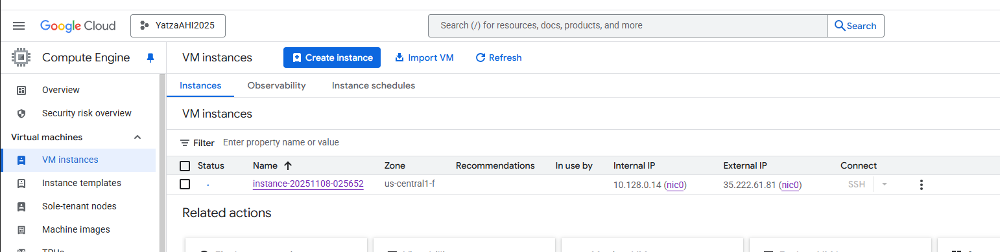

Upon connecting to the VM, I ensured that all necessary packages were installed and configured properly. This included setting up the MySQL server, creating the required databases and tables, and verifying that the environment variables were correctly loaded from the .env file.
1. **Set Up GCP VM**
    * Create a new VM instance in GCP.
        - use a small machine type (e.g., e2-small) to minimize costs.
        - select Ubuntu-minimal as the operating system.
        - enable firewall rules to allow traffic for SSH (default port 22) and MySQL port (default 3306).
        - Connect to the VM using SSH.
    * Install MySQL server and client.
    ```bash
    sudo apt update
    sudo apt install nano mysql-server mysql-client -y
    ```
     - configured bind-address in MySQL configuration to allow remote connections.
     ```bash
     sudo nano /etc/mysql/mysql.conf.d/mysqld.cnf
     ```
    - Changed `bind-address` from `127.0.0.1` to `0.0.0.0` to allow remote connections.
    - Changed 'mysqlbind-address' from `127.0.0.1` to `0.0.0.0` to allow remote connections.
    - Created a new MySQL admin user and database for the project.
    ```sql
    CREATE DATABASE testDb;
    CREATE USER 'dba'@'%' IDENTIFIED BY 'change_me';
    GRANT ALL PRIVILEGES ON testDb.* TO 'dba'@'%';
    FLUSH PRIVILEGES;
    ```
    
    
2. **Install server packages; enable and start service.**
   * Set strong root password (or auth plugin).
   * Edit `/etc/mysql/mysql.conf.d/mysqld.cnf` (bind-address), restart service.
   * Configure firewall/security group rules minimally; note your choices in `setup_notes_vm.md`.
3. **Test Locally VS Code and external Cloud Console (GCP) environment**
    * `mysql -u <user> -p -h <VM_HOSTNAME> -P <VM_PORT> <VM_DATABASE>` from VM opening port 3306
    
    * Validate connectivity from VS Code terminal using the same command.
    * Encountered and resolved connection issues by checking firewall rules and MySQL user permissions to allow allow remote access.
    
    * Address issue with permission problems by granting necessary privileges to the MySQL user to the newly created database.
    * Verified successful connection and data operations using SQLAlchemy in Python.
    * Confirmed the database and table creation, data insertion, and retrieval using pandas was successful by printing the results count to the console.
    * Address issued SSL configuration warnings by explicitly setting the SSL parameter to False in the SQLAlchemy connection string.
    * Resolved utcnow() deprecation warnings by updating the python code to use datetime.now(timezone.utc) instead of utcnow() for timestamp fields.
    
    * Installed the required time and datetime packages to support timezone-aware timestamps.
    * Modified the vm_demo.py script to read and execute SQL commands from an external init.sql file to create the database and grant privileges, improving maintainability and readability of the code.
    * Validated the database and table creation, data insertion, and retrieval using CLI in GCP and GCP VM instance terminal.
    
    
    
4. **Document Steps and Lessons Learned**
    * Documented all steps taken during the setup process, including any challenges faced and how they were resolved.
    * Noted the time taken for each step to compare with the managed MySQL setup.
    * Summarized lessons learned regarding MySQL configuration, remote access, and troubleshooting connection issues.
