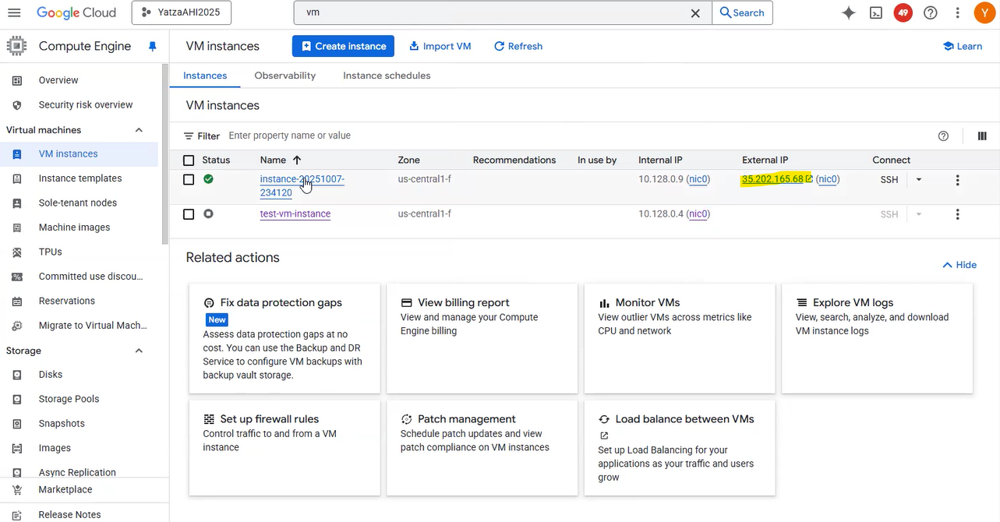
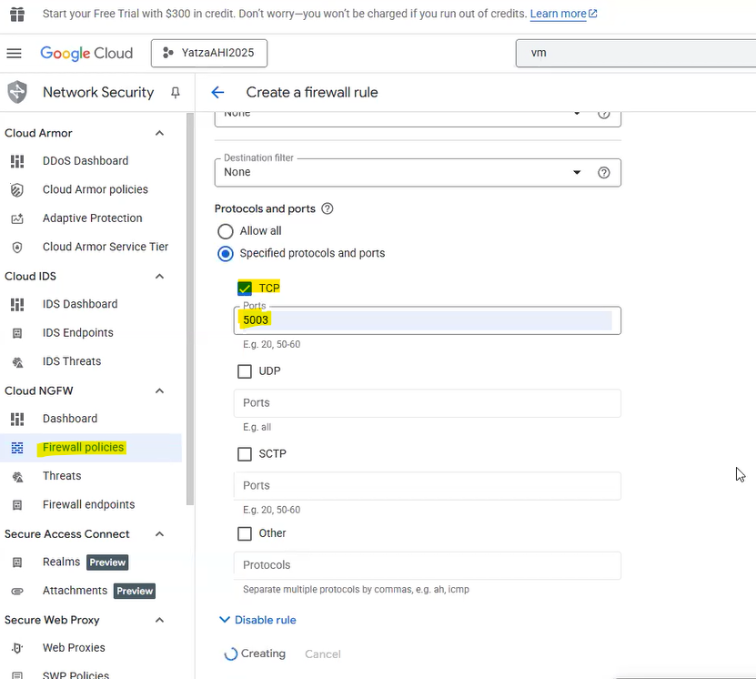
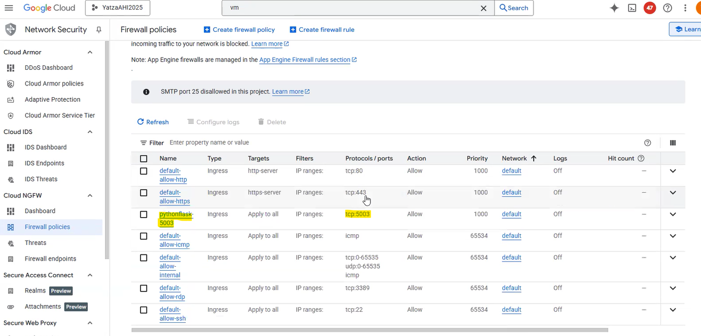
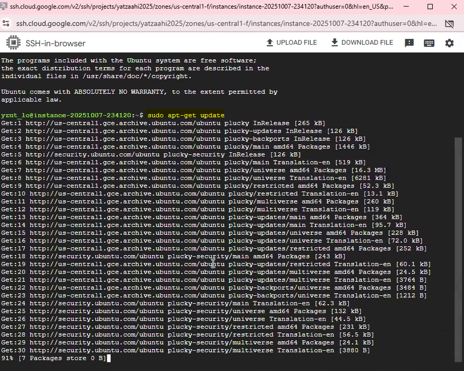
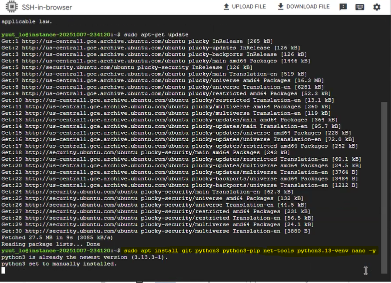
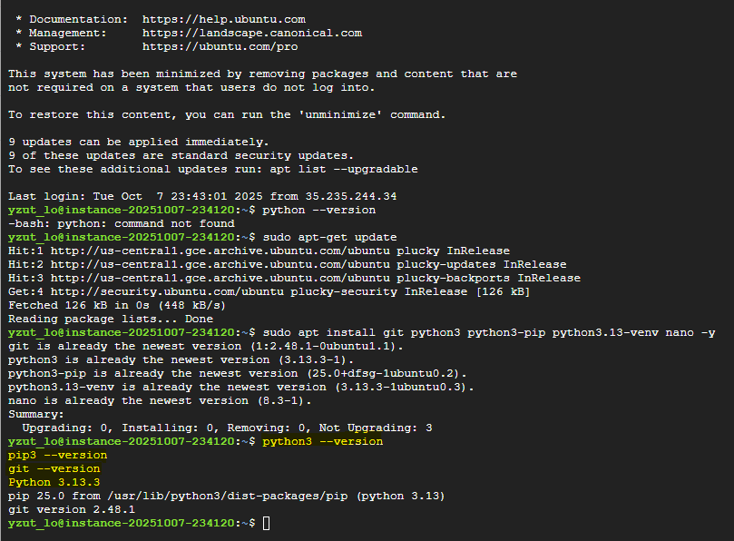
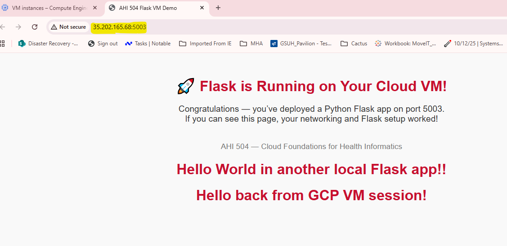
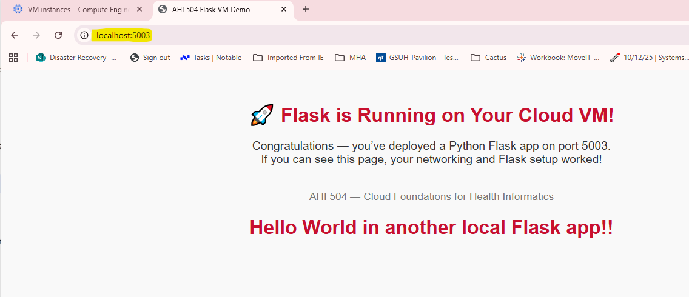

## Flask on Cloud VM (Assignment 2)
##### Student Name: Yatza Lo
##### Cloud Provider: Google Cloud Platform (GCP)
## Videos Recording:
- GCP part 1 - Intro and launching flask on local environment/YouTube: <https://www.youtube.com/watch?v=sZkhsoZYsRQ>
- GCP part 2 - Deploying flask app on GCP cloud VM/YouTube: <https://www.youtube.com/watch?v=uXEJiomjac0>
## Learning goals
- Create a VM on a cloud provider (GCP_Compute Engine)
- Configure the VM 
    - OS: Ubuntu
    - e2-micro instance
- Configure the VM to allow HTTP (80) and HTTPS (443) traffic
- Configure Firewall policies to open custom port 5003
    - Ingress
    - Action on match: yes
    - Source IP ranges: 0.0.0.0/0
- Setup VM
    - SSH into the VM
    - Update the OS
    - Install Python, Git, Flask, VENV, and Nano
    - Clone a gitHub repo
    - Create and activate a virtual environment
    - Install Flask, Python, Git, VENV, and Nano using pip and requirements.txt
- Run a simple Flask app on port 5003 via localhost
- Modify the Flask app using gitHub to return "Hello from New York!"
- Access the Flask app via GCP VM public IP
- (Bonus) Access the app via a custom domain name


## Steps
## 1. VM Creation
- 1. Hamburger navigation menu → Compute Engine → VM instances → Create Instance
- 2. Region/zone: <lowest any cost zone>
- 3. Machine type: <smallest available/free-eligible - e2-micro 0.25-2 vCPU (1 shared core), 1 GB RAM>
- 4. vCPUs to core ratio: <two vCPUs per core>
- 5. Operating System and Storage: <Ubuntu 24.04 LTS Minimal; default 10 GB standard persistent disk>
- 6. Boot disk: <Balanced persistent disk; default minimal size>
- 7. Network: <default IPv4(10.128.0.0/20); default VPC; ephemeral public IP>


## 2. Networking (images\networkPort5003OpenRule.png)
### Set up firewall rule to allow traffic on port 5003


### Check firewall policy to confirm port 5003 is open

## 3. OS Update + Python Install
### Update the package lists for upgrades and new packages
```bash
sudo apt-get update
```

### Install Python3, pip, venv, git, and nano
```bash
sudo apt install git python3 python3-pip python3.13-venv nano -y
```

### Verify installations
```bash
python3 --version
pip3 --version
git --version
```

## 4. Flask App Running
### Clone the gitHub repo
```bash
git clone https://github.com/y0y0l0/HHA504.git
```
### Create and activate a virtual environment
```bash
cd HHA504/cloud_vm_networking_flask
python3 -m venv .venv
source .venv/bin/activate
```
### Install dependencies from requirements.txt
```bash
pip install -r requirements.txt
```
### Navigate to the cloud_vm_networking_flask directory
```bash
cd HHA504/cloud_vm_networking_flask
```
### Run the Flask app on port 5003
```bash
cd scripts
python3 scripts/app.py
```
### Validate the Flask app is running on port 5003 via localhost by accessing the following URLs in a web browser:
URL: http://localhost:5003
```bash
 http://localhost:5003
```

### Validate the Flask app is running on port 5003 via public IP by accessing the following URLs in a web browser:
URL: http://35.202.165.68:5003
```bash
 http://35.202.165.68:5003
```


## 5. Public IP Access
URL: http://35.202.165.68:5003


## 6. (Bonus) Domain Name
Domain: http://mydomain.tech:5003
[screenshot]