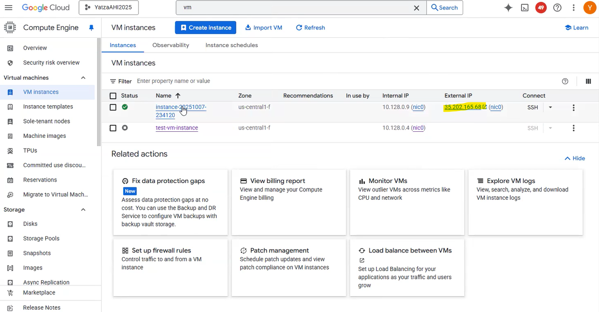

Flask on Cloud VM (Assignment 2)
Student Info
Name: y0y0l0

Cloud Provider: Google Cloud Platform (GCP)
Video recording:

## Learning goals
- Create a VM on a cloud provider (GCP_Compute Engine)
- Configure the VM 
    - OS: Ubuntu
    - e2-micro instance
- Configure the VM to allow HTTP (80) and HTTPS (443) traffic
- Configure Firewall policies to open custom port 5003
    - Ingress
    - Action on match: yes
    - Source IP ranges: 0.0.0.0/0
- Setup VM
    - SSH into the VM
    - Update the OS
    - Install Python, Git, Flask, VENV, and Nano
    - Clone a gitHub repo
    - Create and activate a virtual environment
    - Install Flask, Python, Git, VENV, and Nano using pip and requirements.txt
- Run a simple Flask app on port 5003 via localhost
- Modify the Flask app using gitHub to return "Hello from New York!"
- Access the Flask app via GCP VM public IP
- (Bonus) Access the app via a custom domain name

## Video
- GCP part 1 - intro and launching flask on local environment/YouTube: <https://www.youtube.com/watch?v=sZkhsoZYsRQ>
- GCP part 2 - deploying flask app on cloud VM/YouTube: <https://www.youtube.com/watch?v=uXEJiomjac0>
### Steps
1. VM Creation


2. Networking (images\networkPort5003OpenRule.png)


3. OS Update + Python Install
```bash
sudo apt-get update  # Update the package lists for upgrades and new packages

sudo apt-get install python3 python3-pip python3-venv git nano -y  # Install Python3, pip, venv, git, and nano

```

4. Flask App Running

5. Public IP Access
URL: http://35.202.165.68:5003


6. (Bonus) Domain Name
Domain: http://mydomain.tech:5003
[screenshot]