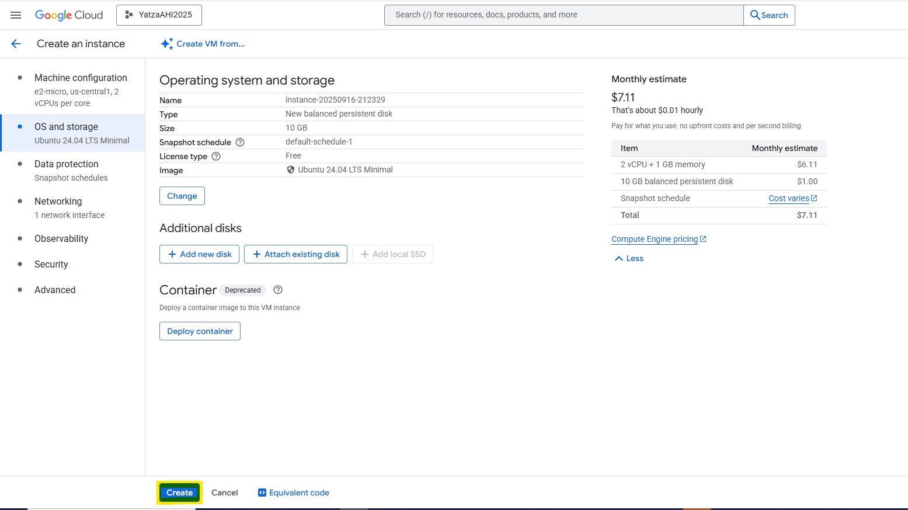
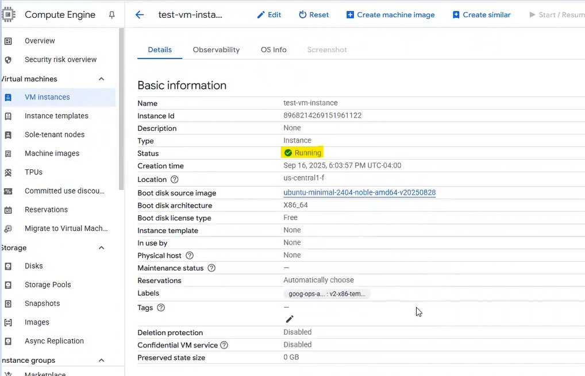
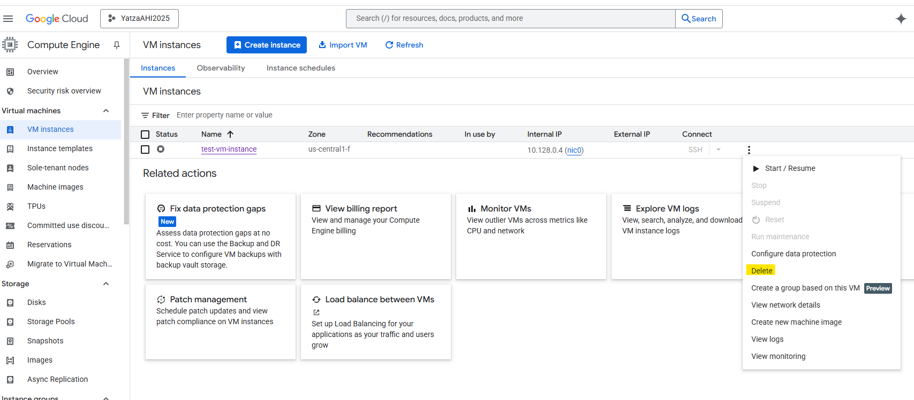

# VM Lifecycle on GCP and OCI — Tutorial

## Video
GCP/Zoom: <https://github.com/y0y0l0/HHA504/blob/main/gcp_oci_vm_tutorial/zoom/gcp_create_start_stop_delete_tutorial.mp4>
OCI/Zoom: <https://github.com/y0y0l0/HHA504/blob/main/gcp_oci_vm_tutorial/zoom/oci_create_start_stop_delete_tutorial.mp4>

## Prereqs
- Cloud access to GCP and OCI
- No PHI/PII; smallest/free-tier shapes

---

## Google Cloud (GCP)
### Create
1. Hamburger navigation menu → Compute Engine → VM instances → Create Instance
2. Region/zone: <lowest cost zone -us-central1 (Iowa)>
3. Machine type: <smallest available/free-eligible - e2-micro 0.25-2 vCPU (1 shared core), 1 GB RAM>
4. vCPUs to core ratio: <two vCPUs per core>
5. Operating System and Storage: <Ubuntu 24.04 LTS Minimal; default 10 GB standard persistent disk>
6. Boot disk: <Balanced persistent disk; default minimal size>
7. Network: <default IPv4(10.128.0.0/20); default VPC; ephemeral public IP>
8. SSH: <allow OS Login; run sudo apt update on first login>

### Start/Stop
- Start: <state shows RUNNING>
- Stop: <state shows TERMINATED/STOPPED>

### Delete
- Delete instance and verify no disks/IPs remain

---

## Oracle Cloud (OCI)
### Create
1. Compartment: <name>
2. Networking: VCN with Internet Connectivity (defaults)
3. Shape: <smallest/free-eligible>
4. Image: Ubuntu (or Oracle Linux)
5. Public IP: ephemeral
6. Boot volume: default minimal

### Start/Stop
- Start: <state shows RUNNING>
- Stop: <state shows STOPPED>

### Terminate
- Terminate and delete boot volume; verify cleanup

---

## Reflections
### Similarities
- <brief bullets>

### Differences
- <brief bullets>

### Preference (OCI vs GCP) and Why
- <one short paragraph>
