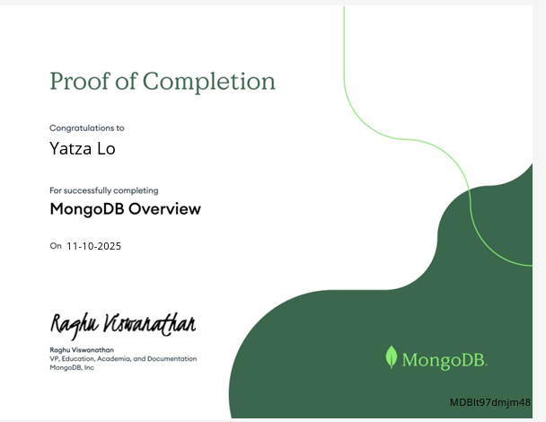
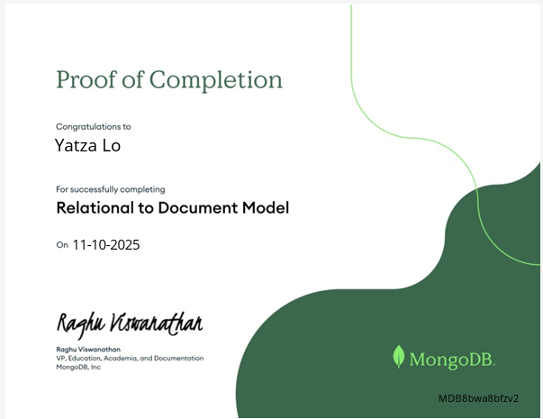

# MongoDB Async Module & Badge Assignment
### Deliverables:
```
mongodb_badge_basics/
├─ README.md
├─ images/
│   ├─ MongoDB_Overview_Badge.png    
│   └─ MongoDB_RelationalToDocumentModel_Badge.png
```
1. Create a new public GitHub repository named: `mongodb_badge_basics`.
2. In this repository:
   - Add a `README.md` file.
   - Upload your badge screenshots (e.g., in an `images/` folder) **or** include working badge URLs.
   - In `README.md`, include:
     - Embedded images and/or links to both badges.
     - A short written response (**max 4–6 sentences total**) addressing:
       1. One or two key differences that stood out to you between relational databases (e.g., MySQL) and non-relational/document databases (e.g., MongoDB).
       2. One **healthcare-specific** scenario where using a non-SQL database like MongoDB would be appropriate, and why.
### Short written response Content:
## 1. One or two key differences that stood out to you between relational databases (e.g., MySQL) and non-relational/document databases (e.g., MongoDB).
- Key difference between relational databases and non-relational databases is the way they handle data structure. 
- Relational databases use a fixed schema with tables and rows, while non-relational databases like MongoDB use a flexible schema with documents and collections. This dynamic unstructured data storage in MongoDB allows for more adaptability in handling diverse data types. Another difference is the query language; relational databases use SQL and data types, whereas MongoDB uses a query language based on JSON and data validations. Another difference is scalability; MongoDB is designed for horizontal scaling, making it easier to distribute data across multiple servers, while relational databases often require vertical scaling. And lastly, MongoDB's document model allows for embedding related data within a single document, reducing the need for complex joins that are common in relational databases.

## 2. One **healthcare-specific** scenario where using a non-SQL database like MongoDB would be appropriate, and why.
In a healthcare setting, a non-SQL database like MongoDB would be appropriate for clinicians to access and manage patient records that include a variety of data types, such as text notes, images, and lab results. The flexible schema and free text search capabilities of MongoDB allow for easy access and integration of new data types and structures as they arise, making it well-suited for the evolving nature of healthcare data with the ease of accommodating new information without requiring extensive database redesigns. For example, storing and retrieving unstructured data like patient progress notes or medical imaging metadata can be efficiently handled in MongoDB.
Another example is USCDI3 requirements to store and share social determinants of health (SDOH) data, which can be highly variable and unstructured, further highlight the need for a flexible database solution like MongoDB in healthcare applications.

## MongoDB Badges
### 1. MongoDB Overview Badge
Credly Profile: https://www.credly.com/users/yatza-lo


Credly Badge Link: https://www.credly.com/earner/earned/badge/03d4edda-e469-4ddc-9403-0aefdb80ee17

### 2. MongoDB Relational to Document Model Badge

Credly Badge Link: https://www.credly.com/earner/earned/badge/92d1048c-4e75-4a47-8ad8-e48cd27c5e00